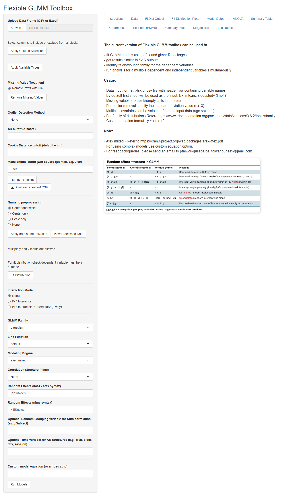

# FlexibleGLMM: A Shiny Application for Flexible Linear/Generalized Mixed Model Analysis
**Overview**

FlexibleGLMM is an open-source R Shiny application designed to provide an interactive graphical user interface (GUI) for performing Generalized Linear Mixed Model (GLMM) analyses without requiring extensive programming knowledge.
The application integrates multiple established R packages, including afex, lme4, nlme, emmeans, and a broad ecosystem of diagnostic and reporting packages, into a unified workflow covering:

-	Data preprocessing and quality control
-	Variable selection and standardization
-	Missing data handling
-	Outlier detection and removal
-	Distribution fitting for selecting appropriate model families
-	Generalized linear mixed model fitting
-	SAS PROC MIXED/PROC GLIMMIX-style Type III hypothesis testing
-	Estimated marginal means (least-square means) and post-hoc comparisons
-	Model diagnostics and performance assessment
-	Publication-ready tables and visualizations
-	Automated reproducible reports

The application is particularly useful for researchers in biomedical, psychological, clinical, and social sciences who routinely analyze repeated-measures, longitudinal, and hierarchical datasets.
________________________________________
**Motivation**

Mixed-effects modeling has become the standard approach for analyzing repeated measurements and clustered data. However, performing a complete GLMM analysis often requires combining several R packages and writing complex statistical code.
Many researchers continue to to rely on different and at times multiple statistical tools. Translating analyses between them and R often requires substantial programming effort and familiarity with differences in covariance structures, denominator degrees-of-freedom approximations, hypothesis testing procedures, and least-squares means estimation.
FlexibleGLMM was developed to address these challenges by bringing together the flexibility of the R statistical ecosystem with a user-friendly point-and-click interface that allows users to conduct sophisticated mixed-model analyses and obtain results comparable to traditional SAS/SPSS workflows.
________________________________________
**Web Application**

FlexibleGLMM can be accessed directly without installation through the Shiny web application:

**Live Application:**

https://puneet-talwar.shinyapps.io/FlexibleGLMM/

**Installation:**

- Install devtools if not already installed

install.packages("devtools")

library(devtools)

- Install FlexibleGLMM package

devtools::install_github("puneettalwar/FlexibleGLMM")

**Launch the App**

Either with

library(FlexibleGLMM)

run_app()

or

FlexibleGLMM::run_app()
________________________________________
**Source Code**

The complete source code is available on GitHub:

**Repository:**

https://github.com/puneettalwar/FlexibleGLMM

Users are welcome to report bugs, suggest new features, and contribute to future development through GitHub Issues and Pull Requests.
________________________________________
**Application Workflow**

FlexibleGLMM follows a sequential workflow from raw data preprocessing to final reporting.
        

Data Import 
↓ 
Data Cleaning & Preprocessing 
↓ 
Distribution Assessment 
↓ 
Model Specification 
↓ 
GLMM Model Fitting 
↓ 
ANOVA & Type III Tests 
↓ 
Estimated Marginal Means 
↓ 
Model Diagnostics 
↓ 
Visualization & Reporting

________________________________________
  
**Main Interface**

The application consists of a left sidebar for configuring the analysis and a main panel containing results tabs.

________________________________________
**Sidebar Features**

**1. Data Upload and Variable Selection**
-	Import datasets in .csv and .xlsx formats.
-	Automatically detect variables.
-	Select variables to include or exclude from analysis.
-	Define variable types (continuous or categorical).
________________________________________
**2. Missing Value Treatment**

The application provides options for handling incomplete observations:
-	Detect missing entries.
-	Remove rows containing missing values.
-	Export the cleaned dataset for external use.
________________________________________
**3. Outlier Detection and Removal**

Multiple outlier detection approaches are available:

**Z-score Method:**
-	Identify observations exceeding a user-defined standard deviation cutoff.

**Cook’s Distance:**
- Detect influential observations using the common threshold: [4/n]
   
**Mahalanobis Distance:**
-	Detects multivariate outliers based on a user-selected chi-square quantile threshold.

**Lookout:**
- Lookout provides an alternative approach for detecting unusual observations using leave-one-out kernel density estimates and extreme value theory.

**DHARMa:**
- Detects outliers using simulated model residuals; therefore, a fitted model is required before diagnostic plots can be generated.

Detected observations can be removed and the cleaned dataset downloaded.
________________________________________
**4. Numerical Data Standardization**

Continuous variables can be transformed using:
-	Centering and scaling (standardization)
- Centering only
-	Scaling only
-	No transformation
The processed data can be viewed directly within the application (in the Data tab).
________________________________________
**5. Distribution Fitting**

For continuous dependent variables, FlexibleGLMM can compare candidate probability distributions using goodness-of-fit statistics.
This helps users select an appropriate distribution prior to model fitting.
________________________________________
**6. Interaction Specification**

Users can automatically specify:
-	No interaction
-	Two-way interactions
-	Three-way interactions
for investigating complex relationships among predictors.
________________________________________
**7. GLMM Family and Link Functions**

The application supports selection of:
-	Response distribution family (gaussian, gamma, beta, binomial and poisson)
-	Appropriate link functions (default, identity, log, logit, probit, cloglog, sqrt, inverse)
allowing analysis of both Gaussian and non-Gaussian outcomes.
________________________________________
**8. Modeling Engines**

FlexibleGLMM integrates multiple mixed-model frameworks.
**afex::mixed**

Provides:
-	Type III ANOVA
-	SAS-like hypothesis testing
-	Support for complex factorial designs
-	Appropriate denominator degree-of-freedom approximations
________________________________________
**lme4**

Provides:
-	Linear mixed models
-	Generalized linear mixed models
-	Flexible random-effects specification
________________________________________
**nlme**

Provides:
-	Linear mixed models with explicit residual correlation structures
-	Repeated-measures covariance modeling
________________________________________
**9. Correlation Structures**

For nlme models, users can specify correlation structures commonly required in longitudinal studies, including:
-	Compound symmetry
-	Autoregressive AR(1)
-	Other supported correlation structures
Additional fields allow users to define:
-	Subject/grouping variables
-	Time variables for autoregressive models
________________________________________
**10. Random Effects Specification**

FlexibleGLMM supports both lme4/afex and nlme random-effect syntax.
Users can specify:
-	Random intercepts
-	Random slopes
-	Nested random effects
-	Crossed random effects
-	Correlated and uncorrelated random structures
The application includes a reference table illustrating common random-effects formulations.
________________________________________
**11. Custom Model Formula**

Advanced users may override the automatically generated model equation and manually define complex models.
________________________________________
**12. Multiple Model Analysis**

FlexibleGLMM supports analysis of:
-	Multiple dependent variables
-	Multiple independent variables
within the same workflow, reducing repetitive model specification.
________________________________________
**Output Tabs**

**Instructions**

Provides:
-	Application instructions
-	Usage examples
-	Random-effects syntax guide
________________________________________
**Data**

Displays:
-	Original or processed datasets
-	Variable information
-	Data tables
________________________________________
**FitDist Output**

Provides:
-	Distribution comparison statistics
-	Goodness-of-fit metrics
-	Ranked candidate distributions
________________________________________
**Fit Distribution Plots**

Provides visual assessment through:
-	Histograms
-	Density curves
-	Q-Q plots
________________________________________
**Model Output**

Displays:
-	Model formula
-	Fixed-effects estimates
-	Random-effects estimates
-	Standard errors
-	Confidence intervals
-	Model statistics
________________________________________
**ANOVA**

Provides:
-	Type I/II/III tests
-	F-statistics
-	Degrees of freedom
-	p-values
with SAS-like Type III tests through afex.
________________________________________
**Summary Table**

Generates publication-ready tables summarizing:
-	Model estimates
-	Statistical significance
-	Confidence intervals
________________________________________
**Performance**

Evaluates:
-	Model fit
-	R² statistics
-	Information criteria
-	Additional performance metrics
________________________________________
**Post-hoc (EMMs)**

Computes:
-	Estimated marginal means (least-square means)
-	Pairwise comparisons
-	Contrasts
-	Multiple comparison corrections
using the emmeans package.
________________________________________
**Summary Plots**

Creates:
-	Effect plots
-	Estimated marginal mean plots
-	Interaction plots
-	Confidence interval visualizations
________________________________________
**Diagnostics**

Provides comprehensive model checking using:
-	Residual plots
-	Q-Q plots
-	Simulated residual diagnostics
-	Influence diagnostics
-	Outlier assessment
using packages such as DHARMa and influence.ME.
________________________________________
**Auto Report**

Automatically generates reproducible reports containing:
-	Data preprocessing summary
-	Model specification
-	Statistical results
-	Figures
-	Diagnostic outputs
________________________________________
**R Packages Used**

**User Interface**

-	shiny
-	DT
-	shinyjs

**Data Handling**

-	readr
-	readxl
-	dataPreparation
-	dplyr

**Mixed Model Analysis**

-	afex
-	lme4
-	nlme
-	emmeans
-	predictmeans
  
**Model Evaluation and Diagnostics**

-	performance
-	DHARMa
-	effectsize
-	parameters
-	r2glmm
-	lookout
-	fitdistrplus

**Reporting and Visualization**

-	ggplot2
-	broom.mixed
-	knitr
-	rmarkdown
-	kableExtra

**Parallel Computing**
-	future
________________________________________
**Example Applications**

FlexibleGLMM can be applied to:
-	Longitudinal clinical studies
-	Repeated-measures experiments
-	Neuroimaging studies
-	Behavioral experiments
-	Multicenter clinical trials
-	Educational and social science research
-	Hierarchical and clustered datasets
________________________________________
**Future Development**

Planned enhancements include:
-	Additional GLMM distributions
-	More covariance structures
-	Enhanced model comparison tools
-	Improved visualization modules
-	Extended reporting options
-	Expanded support for SAS model replication
________________________________________
**Citation**

Puneet Talwar, Fermin Balda Aizpurua, Christophe Phillips, Gilles Vandewalle (2026, July 30). FlexibleGLMM: An R Shiny Application for Generalized Linear Mixed Models Across Multiple Statistical Engines: First formal release (Version 1.0.0). Zenodo. 

**Contact**

**Developer:** Puneet Talwar
University of Liège, Belgium
- For feedback/queries, bug reports, or feature requests, please send an email to ptalwar@uliege.be; talwar.puneet@gmail.com.
